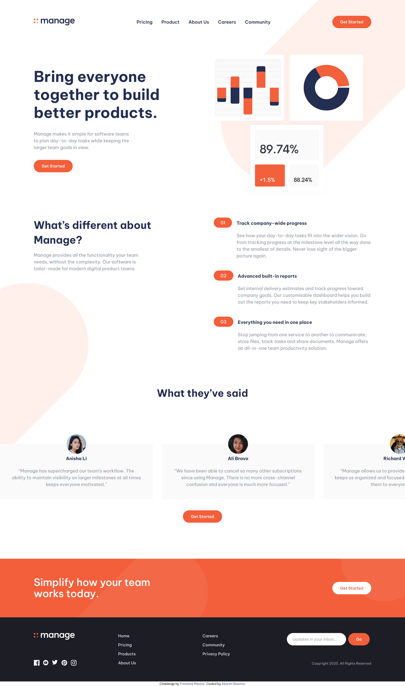
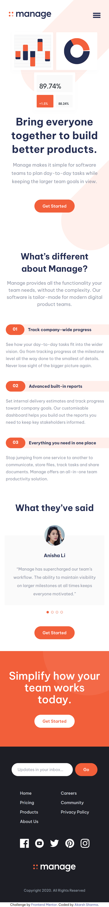
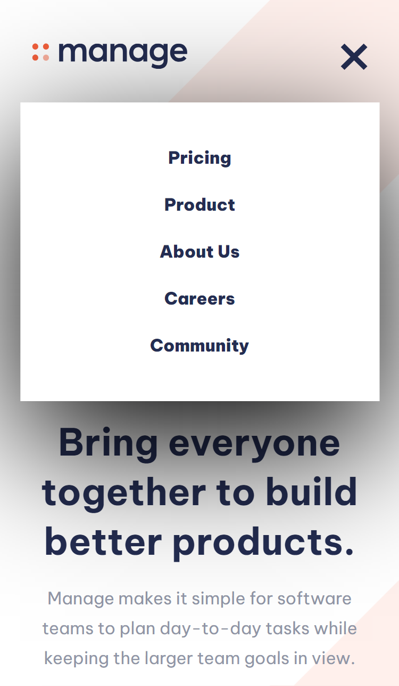

# Frontend Mentor - Manage landing page solution

This is a solution to the [Manage landing page challenge on Frontend Mentor](https://www.frontendmentor.io/challenges/manage-landing-page-SLXqC6P5). Frontend Mentor challenges help you improve your coding skills by building realistic projects. 

## Table of contents

- [Overview](#overview)
  - [The challenge](#the-challenge)
  - [Screenshot](#screenshot)
  - [Links](#links)
  - [Built with](#built-with)
- [Author](#author)

## Overview

The designs were created to the following widths:

- Mobile: 375px
- Desktop: 1440px

### The challenge

Users should be able to:

- View the optimal layout for the site depending on their device's screen size
- See hover states for all interactive elements on the page
- See all testimonials in a horizontal slider
- Receive an error message when the newsletter sign up `form` is submitted if:
  - The `input` field is empty
  - The email address is not formatted correctly

### Screenshot

Desktop

Mobile

Navigation

### Links

- Solution URL: [Github link](https://github.com/akarsh1028/manage-landing-page)
- Live Site URL: [Versel Link](https://manage-landing-page-sooty-phi.vercel.app/)

### Built with

- Semantic HTML5 markup
- CSS custom properties
- Flexbox
- Mobile-first workflow
- [React](https://reactjs.org/) - JS library
- [Next.js](https://nextjs.org/) - React framework
- [TailwindCSS](https://tailwindcss.com/) - CSS framework
- [Github](https://github.com/)
- [Vercel](https://vercel.com/)

## Author

- Website - [Akarsh Sharma](https://akarshsharma.vercel.app/)
- Frontend Mentor - [@akarsh1028](https://www.frontendmentor.io/profile/akarsh1028)
- Github - [@akarsh1028](https://github.com/akarsh1028)
- Linkedin - [@akarshsharma001](https://www.linkedin.com/in/akarshsharma001/)
- Twitter - [@akarsh_sharma__](https://twitter.com/akarsh_sharma__)